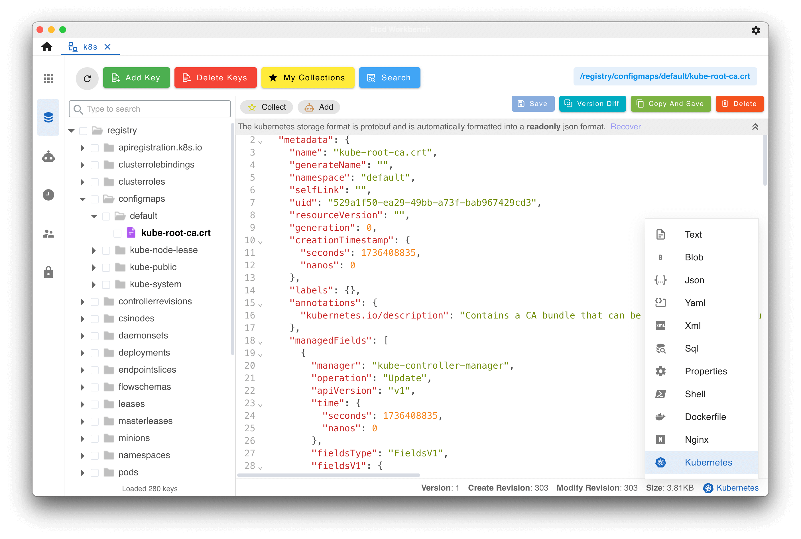

[中文版](./README_ZH.md) | English

<div align=center>


</div>

<div align=center>

   

</div>

# Etcd Workbench

A beautiful and lightweight ETCD V3 client. Provides App and Web packages. Supports SSL and SSH Tunnel connections.

# Features

1. This tool is completely open source and free!
2. Provides two packages: App and Web. The app can be run directly on your local, and the web package can be deployed to the server directly or using docker.
3. Very lightweight, App package is only **4M**, Web package is only **15M**.
4. Support theme switching.
5. Support multiple connection management.
6. Support SSL, SSH connection.
7. Support cluster information viewing, version compression, data backup and other functions.
8. Support Key-Value editing, multi-language format highlighting, batch import/export.
9. Support comparison of multiple versions of key.
10. Support lease management: creation, deletion, key bind relationship, countdown display.
11. Support user management: enable/disable authentication, creation, deletion, grant/revocation of roles, etc.
12. Support role management: creation, deletion, authorization/revocation of permissions, etc.

- **App**: It has all the functions, has a better experience than the web version, and is easy to migrate data. It will be continuously updated in the future. It is recommended to use.
- **Web**: It has most of the functions, but a few functions are not supported (such as data backup, etc.). Users can access it directly with a browser without downloading. It supports multi-user login. **Updates will be stopped in a future version**!

# Download

Please go to [website](https://tzfun.github.io/etcd-workbench/) to download the latest version. If you need to download historical versions, please go to [releases](https://github.com/tzfun/etcd-workbench/releases).

- App: The version number is prefixed with **App**, for example `App-1.0.0`
    - Support `windows-x86_64`
    - Support `macos-x86_64`
    - Support `macos-aarch64`
- Web: Version numbers are prefixed with **Web**, for example `Web-1.1.4`
    - Supported docker platforms: `linux/amd64`, `linux/arm64`, `windows/amd64`

> Note: All versions on and before May 10, 2024 are web versions. This prefix rule will be used starting from the first app version released on August 30, 2024.

# Document for Web

## 1. Quick Start

### 1.1 Start Online

Access [http://etcd.beifengtz.com](http://etcd.beifengtz.com)

* account：test
* password：test

> **Note** This test client is for display only. Please do not save real connection information in it. The saved information will be public to all people who log in to the test account.
> Demo will not retain or record all connection information, but to avoid leaking your connection information, please use the test ETCD address or use a private deployment experience.

### Start on Locally

First, make sure your local environment has JDK 11 or above, download the latest jar package from [release](https://github.com/tzfun/etcd-workbench/releases) and execute:

```shell
java -jar etcd-workbench.jar
```

Access `http://localhost:8002` in browser.

## 2. Private Deployment

### 2.1 Configuration

The configuration of web deployment is very simple, only one configuration file is required, and the configuration content is very small. For the complete configuration file, please see [etcd-workbench.conf](server/src/main/resources/etcd-workbench.conf).

### 2.2 Run in Local

First, make sure that your local environment has the **JDK 11+** version, download the latest jar package from [release](https://github.com/tzfun/etcd-workbench/releases), and place the configuration file `etcd-workbench.conf` in the same directory as the jar package to take effect. Execute startup:

```shell
java -jar etcd-workbench.jar
```

Access `http://localhost:8002` in browser.

### 2.3 Run in Docker

Docker hub repository address: [https://hub.docker.com/r/tzfun/etcd-workbench](https://hub.docker.com/r/tzfun/etcd-workbench)

Pull the Docker image:

```shell
docker pull tzfun/etcd-workbench
```

Start container:

```shell
docker run \
    --name my-etcd-workbench \
    -p 8002:8002 \
    -v ./etcd-workbench.conf:/usr/tzfun/etcd-workbench/etcd-workbench.conf \
    -d \
    tzfun/etcd-workbench:latest
```

The working directory of the image is in `/usr/tzfun/etcd-workbench`, and its directory structure is as follows:

```
/usr/tzfun/etcd-workbench # tree
├── bin
├── data
├── logs
├── temp
├── etcd-workbench.conf
└── etcd-workbench.jar
```

# Screenshot

## Screenshot for App




## Screenshot for Web


# Development Stack

## For App

The front-end is developed based on Vue, and the back-end is developed based on Rust, with memory safety, low consumption and high performance.

- **Tauri** - App Framework
- **Tokio** - Asynchronous IO communication
- **etcd-client** - Etcd Connector
- **Vuetify** - UI Framework

## For Web

The front-end is developed based on Vue, and the back-end is developed based on Java.

- **[Jvmm](https://github.com/tzfun/jvmm)** - Server Framework
- **Netty** - Asynchronous IO communication
- **jetcd** - Etcd Connector
- **element-plus** - UI Framework

# License

[Apache License 2.0](LICENSE)